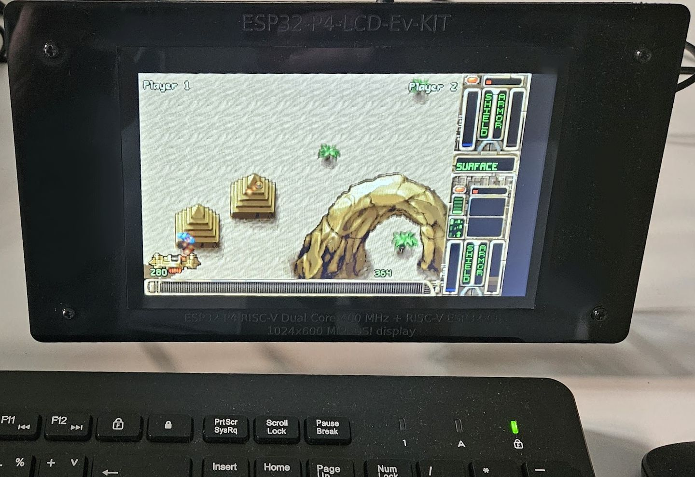
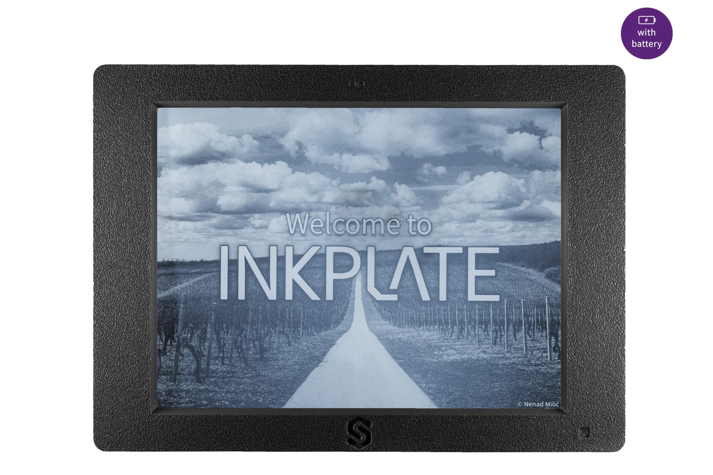
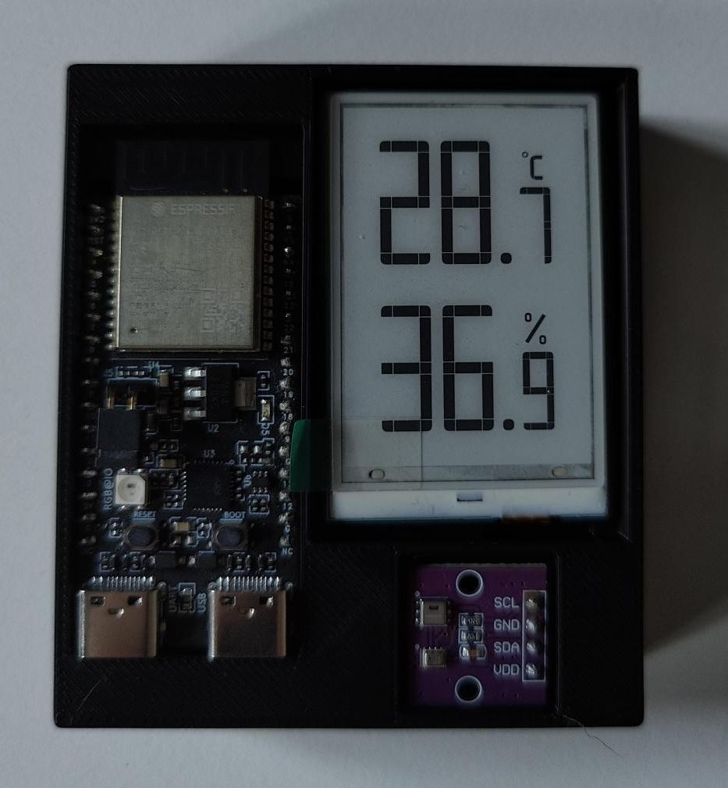
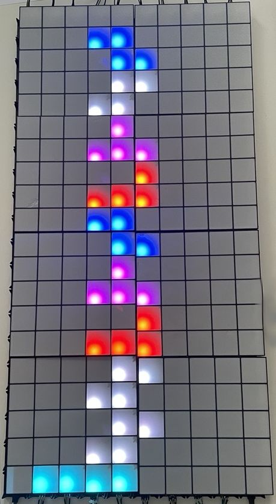
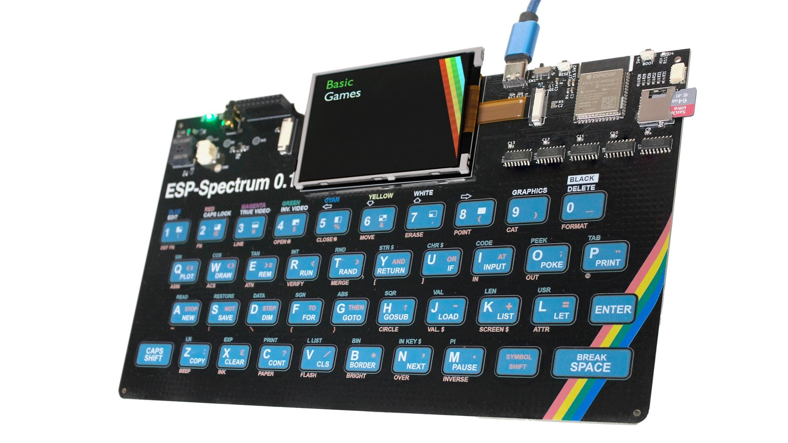
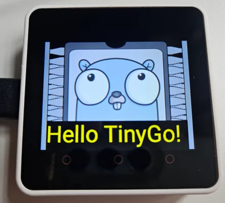
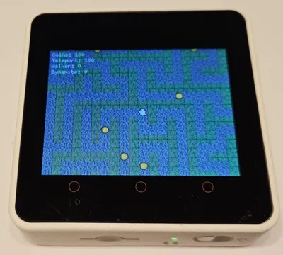

English | [**Česky**](README.cs.md)

Tento repozitář obsahuje zdroje pro ukázky prezentované společností Espressif System na Maker Faire.

[Maker Faire Prague, 2026](https://makerfaire.cz/projekt/espressif-systems-czech/) (Espressif Systems: hala E, stánek 100)

## Doporučené zdroje

- [Espressif Developer Portal](https://developer.espressif.com/)
- [ESP-IDF ESP32-C6 Workshop (English)](https://developer.espressif.com/workshops/esp-idf-with-esp32-c6/)
- [ESP-IDF ESP32-C6 Workshop (Česky)](https://developer.espressif.com/cs/workshops/esp-idf-with-esp32-c6/)
- [EIM Installer of ESP-IDF 6.x](https://dl.espressif.com/dl/eim/)
- [Wokwi Simulator](https://wokwi.com/esp32)
  - [VS Code Extension](https://docs.wokwi.com/vscode/getting-started)
  - [CLion Extension](https://plugins.jetbrains.com/plugin/23826-wokwi-simulator)

## Ukázky

| Demo                                                                                                                                                                                                                                                                                                                                                                 | Foto                                     |
|----------------------------------------------------------------------------------------------------------------------------------------------------------------------------------------------------------------------------------------------------------------------------------------------------------------------------------------------------------------------|------------------------------------------|
| [MultiPlayer OpenTyrian - ESP32-P4](https://github.com/georgik/OpenTyrian) s podporou USB klávesnice a myši, vykreslování založeno na [SDL3](https://components.espressif.com/components/georgik/sdl/)                                                                                                                                                                  |        |
| [ESP32-C6 Low Power Demo](https://codeberg.org/georgik/esp32-c6-low-power-uart) s [M5Stack VA Meter](https://docs.m5stack.com/en/core/VA%20Meter) pro monitorování spotřeby na 3V3 a [ESP32-P4 UART Monitor](https://codeberg.org/georgik/esp32-p4-ui-uart-logger), vykreslování založeno na [Raylib](https://components.espressif.com/components/georgik/raylib) |            |
| [ESP32-P4 Riverdi Display - LVGL](https://riverdi.com/)                                                                                                                                                                                                                                                                                                              |            |
| [ESP32-C3 Inkplate - Soldered](https://soldered.com/)                                                                                                                                                                                                                                                                                                                |  |
| [ESP32-Doom](https://github.com/georgik/esp32-doom/tree/feature/m5stack-atom) na [M5Stack AtomS3R](https://github.com/m5stack/M5AtomS3) + [Atom Joystick](https://docs.m5stack.com/en/app/Atom%20JoyStick)                                                                                                                                                           |  |
| [ESP32-C6 LowPower eInk - NuttX](https://github.com/eren-terzioglu/c6_ulp_eink_nuttx)                                                                                                                                                                                                                                                                                |               |
| [ESP32-C3 BLE Tetris - Rust no_std](https://github.com/Hahihula/esp-ble-nostd-tetris)                                                                                                                                                                                                                                                                                |             |
| [ESP32 Rainbow](https://www.esp32rainbow.com/) - emulátor ZX Spectrum                                                                                                                                                                                                                                                                                                |               |
| [M5Stack Core2 - TinyGo](https://codeberg.org/georgik/m5stack-core2-tinygo-example)                                                                                                                                                                                                                                                                                  |        |
| [M5Stack Core2 - Spooky Maze Game](https://github.com/georgik/esp32-spooky-maze-game) - [Bevy s Rust no_std](https://developer.espressif.com/tags/bevy/)                                                                                                                                                                                                          |   |
| [T-rexino](https://github.com/SuGlider/T-Rexino)                                                                                                                                                                                                                                                                                                                     |                 |
| [Matter](https://github.com/espressif/esp-matter)                                                                                                                                                                                                                                                                                                                    |                   |
| [Bruce](https://bruce.computer)                                                                                                                                                                                                                                                                                                                                      |                    |
| [ChatGPT](https://github.com/espressif/esp-box/tree/master/examples/chatgpt_demo)                                                                                                                                                                                                                                                                                    |                 |
| [ESP32-S3-Box-3](https://github.com/espressif/esp-box/tree/master/examples/mp3_demo)                                                                                                                                                                                                                                                                                 |                |
| [WLED](https://kno.wled.ge)                                                                                                                                                                                                                                                                                                                                          |                    |
| [Audio Development Framework (ESP-ADF)](https://github.com/espressif/esp-adf/tree/master/examples/player/pipeline_http_mp3)                                                                                                                                                                                                                                          |                 |
| [ESP Serial Flasher demo](https://github.com/Dzarda7/esf-demo)                                                                                                                                                                                                                                                                                                       |                |
| [Slint demo](https://slint.dev)                                                                                                                                                                                                                                                                                                                                      |              |
| [Arduino Zigbee](https://github.com/P-R-O-C-H-Y/EmbeddedWorldZigbeeDemo2025)                                                                                                                                                                                                                                                                                         |          |
| [Arduino Matter](https://github.com/SuGlider/EmbeddedWorldMatterDemo2025)                                                                                                                                                                                                                                                                                            |          |
| [ESPot](https://github.com/Honza0297/espot)                                                                                                                                                                                                                                                                                                                          |                   |
| [HOPE XV Electronic Badge](https://wiki.hope.net/index.php?title=HOPE_XV_Electronic_Badge#Open_Hardware)                                                                                                                                                                                                                                                             |           |
| [Minino](https://electroniccats.com/store/minino/)                                                                                                                                                                                                                                                                                                                   |                  |
| [Franziniho Wi-Fi](https://github.com/Franzininho)                                                                                                                                                                                                                                                                                                                   |         |
| [Walter IoT](https://www.quickspot.io)                                                                                                                                                                                                                                                                                                                               |              |
| [ESP32-P4 Eye](https://docs.espressif.com/projects/esp-dev-kits/en/latest/esp32p4/esp32-p4-eye/user_guide.html)                                                                                                                                                                                                                                                      |            |

## Zajímavý projekt?

Máte zajímavý projekt, který chcete ukázat komunitě? Dejte nám vědět.

