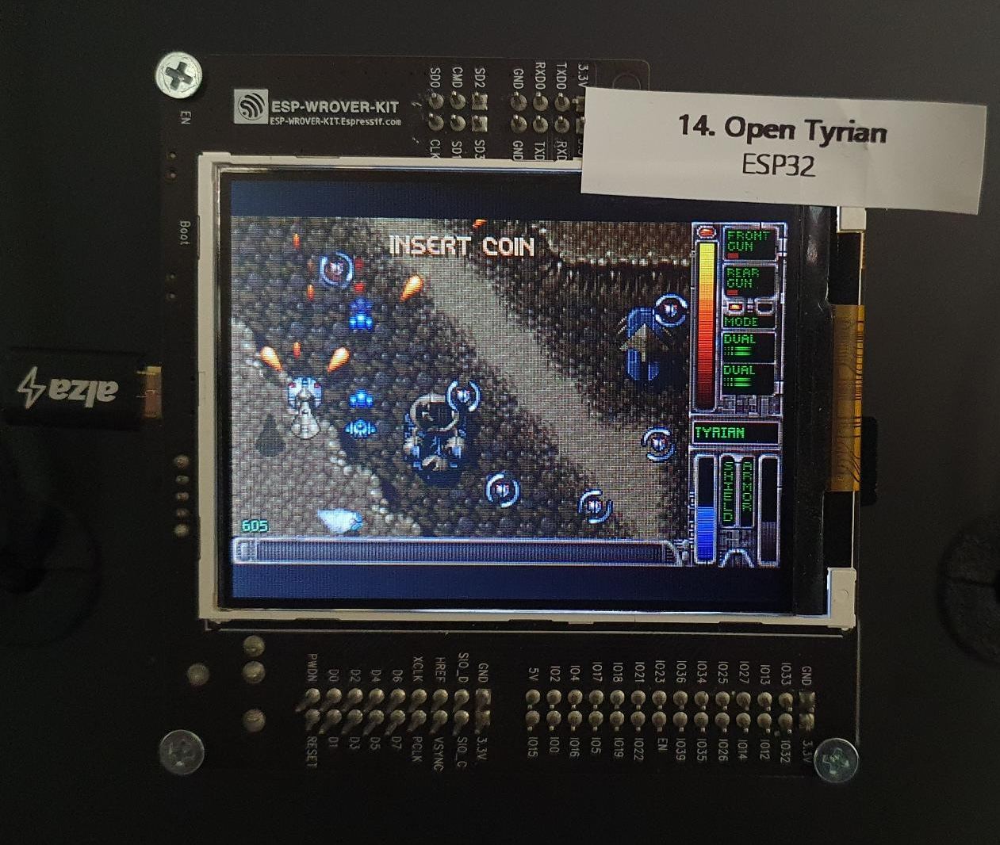

This repository hosts resources for all the demos presented by Espressif at Maker Faire.

Maker Faire Prague, 2025 (Espressif presentation: hall C, stand 70)
| Demo | Photo |
|------|-------|
|1. [Open Tyrian](https://github.com/georgik/OpenTyrian)||
|2. [ESP-Snake](https://github.com/peterdragun/esp-snake) [NuttX](https://github.com/NuttX/NuttX)||
|3. [T-rexino](https://github.com/SuGlider/T-Rexino)||
|4. [Flow3r](https://git.flow3r.garden/flow3r)||
|5. [Time-O-Mat](https://github.com/vedatori/time-o-mat)||
|6. [Matter](https://github.com/espressif/esp-matter)||
|7. [Bruce](https://github.com/espressif/esp-box)||
|8. [ChatGPT](https://github.com/espressif/esp-box/tree/master/examples/chatgpt_demo)||
|9. [ESP32-S3-Box-3](https://github.com/espressif/esp-box/tree/master/examples/mp3_demo)||
|10. [WLED](https://kno.wled.ge)||
|11. [Audio Development Framework (ESP-ADF)](https://github.com/espressif/esp-adf/tree/master/examples/player/pipeline_http_mp3)||
|12. [ESP Serial Flasher demo](https://github.com/Dzarda7/esf-demo)||
|13. [Slint demo](https://slint.dev)||
|14. [ESP32-P4 USB Camera](https://github.com/peter-marcisovsky/esp-usb-demo?tab=readme-ov-file)||
|15. [Arduino Zigbee](https://github.com/P-R-O-C-H-Y/EmbeddedWorldZigbeeDemo2025)||
|16. [Arduino Matter](https://github.com/SuGlider/EmbeddedWorldMatterDemo2025)||
|17. [ESPot](https://github.com/Honza0297/espot)||
|18. [Tetris](https://github.com/Hahihula/no_std_tetris/tree/master/esp32_c3_example)||
|19. [HOPE XV Electronic Badge](https://wiki.hope.net/index.php?title=HOPE_XV_Electronic_Badge#Open_Hardware)||
|20. [Minino](https://github.com/espressif/esp-box)||
|21. [Franziniho Wi-Fi](https://github.com/espressif/esp-box)||
|22. [Walter IoT](https://github.com/espressif/esp-box)||
