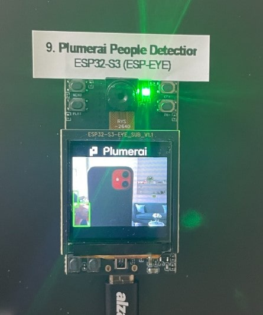

This repository hosts resources for all the demos presented by Espressif at Maker Faire.

Maker Faire Brno, 2023 (Espressif presentation: hall A, stand 53)
| Demo | Photo |
|------|-------|
|1. [ESP32-S3 Multiple LCD Demo](https://github.com/espzav/Multiple-LCD-Demo)||
|2. [Pac-Man Demo](https://github.com/SuGlider/Pacman)||
|3. [ESP32-S3-Box-3 Default Demo](https://github.com/espressif/esp-box/tree/master/examples/factory_demo)||
|4. [ESP-Box Webcam Monitor Demo](https://github.com/espzav/UVC-Camera-and-MSC-LVGL-Example)||
|5. [ESP32-S3 EV Board LVGL Demo](https://github.com/espressif/esp-bsp/tree/master/examples/display_lvgl_demos)||
|6. [ESP-Box Brick Game](https://doc.embedded-wizard.de/getting-started-esp32)||
|7. [ESP32 Spooky Maze Game](https://github.com/georgik/esp32-spooky-maze-game)||
|8. [NES Emulator Demo on ESP32-S3](https://github.com/espzav/esp32-nesemu/tree/idf_5.0)| |
|9. [Plumerai People Detection on ESP32-S3](https://docs.plumerai.com/1.10/people_detection_esp32_s3_demo/)||
|10. [QR Code Reader Demo](https://github.com/espressif/qrcode-demo/)||
|11. [M5 Stack ESP32 Demo](https://github.com/m5stack/Core2-for-AWS-IoT-Kit/tree/master/Factory-Firmware)||
|12. [ESP32-C3-LCDKit](https://www.youtube.com/watch?v=Vi1wvuoyhuM)||
|13. [Arduino Memory Game](https://github.com/PilnyTomas/arduino-memory-game/tree/maker_fair)||
|14. [ESP32-Buddy Trolleybus Animation](https://github.com/georgik/esp32-buddy-rs/blob/main/examples/car.rs)||
|15. [Retro-Nino](https://www.linkedin.com/feed/update/urn:li:activity:7016758367142432768/)||
|16. [HEXpressif](https://github.com/kumekay/hexpressif)||
|17. [Espressif sign](https://kno.wled.ge/)||

